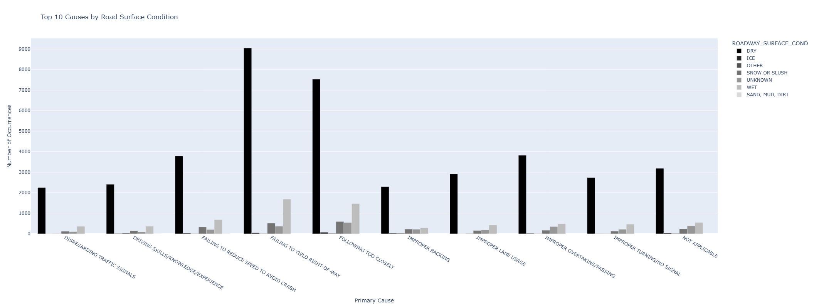

# **MODELING THE PRIMARY ACCIDENT CAUSE IN CHICAGO**

## Table of contents.
- [Project Overview](#project-overview)
- [Data Sources](#data-sources)
- [Data Exploration](#data-exploration)
- [Visualisations](#Visualisations)
- [Installation](#installation)
- [Usage](#usage)
- [Acknowledgments](#acknowledgments)

## **Project Overview**
Car accidents are complex events influenced by multiple factors, including vehicle characteristics, occupant details, road conditions, and weather. Understanding the primary contributory cause of an accident can help authorities implement better safety measures, reduce accident rates, and save lives.
The objective of this project is to develop a predictive model that accurately identifies the primary contributory cause of a car accident using data related to:

1. Vehicle Information: Type, condition, and features of the car.

2. Occupant Details: Age, seatbelt usage, and other relevant information about the people in the vehicle.

3. Road Conditions: Road type, surface condition, and traffic control devices.

4. Weather Conditions: Visibility, precipitation, and other environmental factors.

### **Approach:**

1. Data Collection and Preprocessing: Gather a multiclass dataset containing detailed accident records.
Clean the data and perform feature engineering to extract useful features.
Handle class imbalance using techniques like oversampling, undersampling, or class weighting.

2. Modeling: Test multiple classification algorithms, including:
Traditional Machine Learning Models: Decision Tree, Random Forest and XGBoost.

3. Evaluation: Evaluate the models using metrics like Accuracy, Precision, Recall, F1-Score, and AUC.
Perform hyperparameter tuning using GridSearchCV or RandomizedSearchCV to optimize model performance.
Interpretation and Insights:

4. Analyze feature importance to understand key factors contributing to accidents.
Provide actionable insights for road safety improvements.

### **Expected Outcome:**
A robust classification model capable of accurately predicting the primary contributory cause of car accidents, which can be utilized by transportation authorities, policymakers, and safety organizations to enhance traffic safety measures and reduce accident rates.

## **DATA SOURCE**
The data was obtained from Chicago Data Portal :https://data.cityofchicago.org/. Data used are:

1. Traffic crashes- Crashes.
2. Traffic Crashes - Vehicles.
3. Traffic Crashes - People.

## Data Exploration
- **Tools:**
  - Python (Pandas, NumPy, Matplotlib, Seaborn,Sklearn)

## **Visualizations**
### Top 10 most common accident causes.

1. Failing to yield right-of-way.
2. Following too closely.
3. Failing to reduce speed to avoid crash.
4. Improper overtaking.
5. Improper lane usage.
6. Improper turning.
7. Improper backing.
8. Driving skills.
9. Disregarding traffic signals

### Top 10 causes by weather conditions and road surface conditions
 


Accidents are more rampant on dry road and clear waether.

###  Top 10 Vehicle make and model prone to accidents.


The top 10 vehicles most prone to accidents are
1. TOYOTA CAMRY with 87,396 accidents reported
2. HONDA CIVIC with 52,375 accidents reported
3. HONDA ACCORD with 47,035 accidents reported
4. CHEVROLET IMPALA with 37,739 accidents reported
5. NISSAN ROGUE with 36,619 accidents reported
6. FORD EXPLORER with 36,474 accidents reported
7. CHEVROLET EQUINOX with 34,638 accidents reported
8. HYUNDAI ELANTRA with 31,584 accidents reported
9. TOYOTA COROLLA with 30,719 accidents reported
10. NISSAN ALTIMA with 30,009 accidents reported

## **Best Model**
**XGBoost Classifier**. This is due to its uperior AUC Performance. An AUC of(98.01%) indicates excellent capability in distinguishing between classes, ensuring high sensitivity and specificity.


## **Installation**

To set our the project locally, follow these steps:

1. **Clone the repository**:

   ```bash
   git clone https://github.com/Mkayatw0/Phase_3_project.git
   ```

2. **Navigate to the project directory**:

   ```bash
   cd Phase_3_project
   ```

## **Usage**

After installation, you can explore the project using the provided Jupyter Notebooks:

1. **Launch Jupyter Notebook**:

   ```bash
   jupyter notebook
   ```

2. **Open the main analysis notebook**:

   - `technical_presentation.ipynb`: Contains the primary data analysis and visualizations.

3. **Run the notebook cells** to execute the analysis step-by-step.
   
## **Acknowledgments**

- **Data Providers**:
Chicago Data Portal :https://data.cityofchicago.org/.